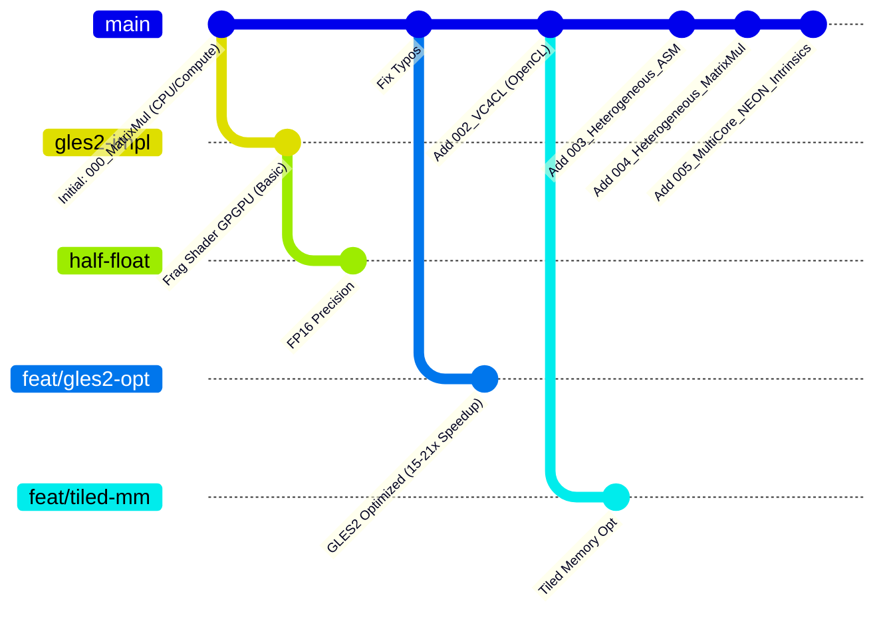

# HPC & GPGPU on Raspberry Pi 3B

**Exploring High-Performance Computing on Legacy Hardware**

This repository documents the journey of extracting maximum parallel compute performance from the **Raspberry Pi 3 Model B (Broadcom BCM2837)**. It progresses from standard graphics APIs to bare-metal assembly, comparing the **ARM Cortex-A53 CPU** against the proprietary **VideoCore IV GPU**.

##  🌳 Repository Structure & Git Flow

This project uses several branches to explore different optimization strategies and API implementations.



### 🌿 Branch Guide

| Branch | Description | Key Tech | Status |
| --- | --- | --- | --- |
| **`master`** | Stable mainline. Contains all MWEs (000-005) in their "standard" state. | OpenCL, ASM, NEON | 🟢 Stable |
| **`feature/gles2-gpgpu`** | Optimized OpenGL ES 2.0 implementation of `000_MatrixMul`. | GLES 2.0, Fragment Shaders | 🚀 **Fastest GLES** |
| **`half-float-gpgpu`** | Experimental `000_MatrixMul` using 16-bit floating point textures. | GL_OES_texture_half_float | 🧪 Experimental |
| **`feat/tiled-matmul`** | Tiled memory optimization for `002_VC4CL_MatrixMul` to reduce memory bandwidth pressure. | OpenCL Local Memory | 🧪 Experimental |

---

## 📂 Minimal Working Examples (MWEs)

The repository is organized into numbered examples, progressing in complexity and "closeness to the metal."

### [000_MatrixMul](https://www.google.com/search?q=./examples/000_MatrixMul)

**The Baseline: OpenGL ES 2.0 GPGPU**

* **Goal:** Perform matrix multiplication () using the graphics pipeline.
* **Challenge:** VideoCore IV lacks Compute Shaders (OpenGL 4.3).
* **Solution:** "Classic GPGPU" using Fragment Shaders and Render-to-Texture (Ping-Pong).
* **Performance:**
* CPU (Scalar): ~19 ms
* GPU (GLES2 Optimized): ~1.23 ms
* **Speedup:** ~15x (on 64x64 matrices)


### [002_VC4CL_MatrixMul](https://www.google.com/search?q=./examples/002_VC4CL_MatrixMul)

**Standard GPGPU: OpenCL**

* **Goal:** Use standard OpenCL C to write kernels for the GPU.
* **Tech:** Uses the [VC4CL](https://github.com/doe300/VC4CL) driver (reverse-engineered OpenCL for Pi).
* **Variants:**
* *Scalar:* Naive implementation (slow).
* *Vectorized:* Uses `float16` types to utilize the QPU's 16-way SIMD.
* *Tiled (Branch):* Uses Local Memory to cache tiles of  (mitigates the "Memory Wall").


* **Performance:** ~0.31 GFLOPS (Vectorized).

### [003_Heterogeneous_Assembly](https://www.google.com/search?q=./examples/003_Heterogeneous_Assembly)

**Bare Metal: Hello World**

* **Goal:** Bypass all drivers and write assembly directly for both processors.
* **CPU:** ARMv7 Assembly (`add r0, r0, r1`).
* **GPU:** QPU Assembly (Writes magic number `0x1337` to VPM).
* **Tech:** Uses `vc4asm` and the Mailbox Interface (`/dev/vcio`).
* **Note:** Requires disabling the kernel graphics driver (`dtoverlay=vc4-kms-v3d`).

### [004_Heterogeneous_MatrixMul](https://www.google.com/search?q=./examples/004_Heterogeneous_MatrixMul)

**Bare Metal: The Ultimate Benchmark**

* **Goal:** Heterogeneous matrix/vector multiplication using hand-optimized assembly.
* **CPU:** ARM NEON SIMD (128-bit) 4x4 Matrix Multiply.
* **GPU:** QPU SIMD (512-bit) 16-element Vector Multiply.
* **Tech:** Manual VPM (Vertex Pipe Memory) and DMA management.
* **Results:**
* NEON (CPU): 2.00 µs (4x4 Matrix)
* QPU (GPU): 106.00 µs (16-element Vector including overhead)


### [005_MultiCore_NEON_Intrinsics](https://www.google.com/search?q=./examples/005_MultiCore_NEON_Intrinsics)

**CPU Optimization: Speed of Light**

* 
**Goal:** Saturate all 4 Cortex-A53 cores using SIMD and Multi-threading.


* **CPU:** 4x Cortex-A53 @ 1.4GHz.
* 
**Tech:** C-level NEON Intrinsics + OpenMP + Register Blocking.


* **Results:**
* Naive Triple-Loop: ~0.01 GFLOPS
* NEON + OpenMP: **~3.72 GFLOPS** (Measured) 


* Speedup: **~270x** vs Naive C++ 


---

## 📊 Performance Summary

Comparison of different implementations running on Raspberry Pi 3B:

| Implementation | Architecture | API | Precision | Measured GFLOPS |
| --- | --- | --- | --- | --- |
| **CPU (Scalar)** | Cortex-A53 | C++ | FP32 | ~0.01 |
| **CPU (NEON + OMP)** | Cortex-A53 (4-Core) | Intrinsics | FP32 | **~3.72** |
| **GPU (GLES2)** | VideoCore IV | OpenGL | FP16/Fixed | ~0.48 |
| **GPU (VC4CL)** | VideoCore IV | OpenCL | FP32 | ~0.31 |
| **GPU (QPU)** | VideoCore IV (SIMD) | ASM | FP32 | ~24.0 (Theoretical) |

> **Note:** The "Memory Wall" is the primary bottleneck on the Raspberry Pi 3B. While the QPU is mathematically capable of 24 GFLOPS, the shared memory bus prevents feeding it data fast enough in most real-world scenarios.

---

## 🛠️ Prerequisites

To run these examples, you will generally need:

1. **Hardware:** Raspberry Pi 3B / 3B+ (Pi 4/5 have different GPU architectures and are not supported by `vc4asm` examples).
2. **OS:** Raspberry Pi OS (32-bit recommended for Assembly compatibility).
3. **Drivers:**
* `libgles2-mesa-dev` for OpenGL examples.
* `VC4CL` for OpenCL examples.
* **NO Drivers** for Examples 003/004 (must disable `vc4-kms-v3d`).


### Quick Start (Dependencies)

```bash
sudo apt update
sudo apt install -y cmake g++ git build-essential
sudo apt install -y libgles2-mesa-dev libgbm-dev libdrm-dev  # For 000

```

## 📜 License

MIT License. See [LICENSE](https://www.google.com/search?q=./LICENSE) for details.
